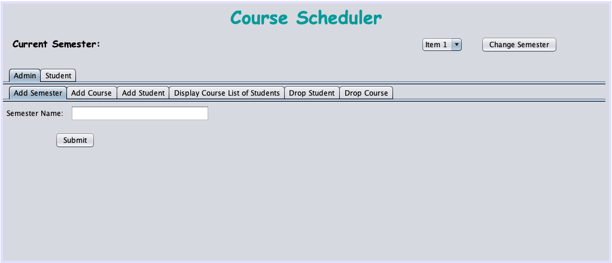
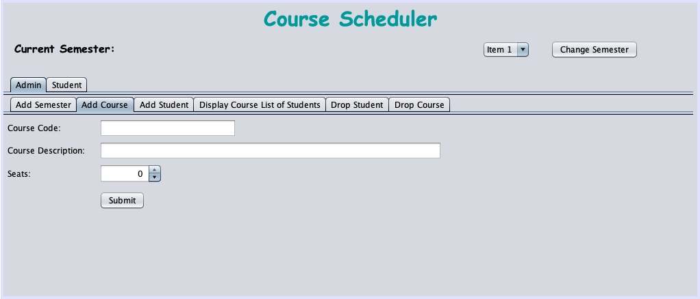
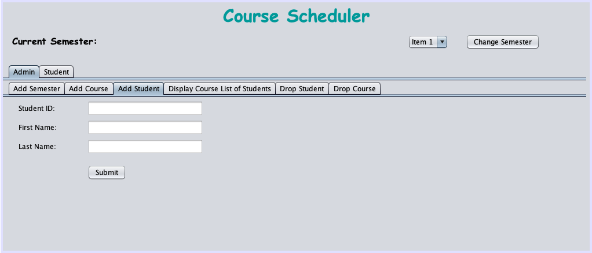
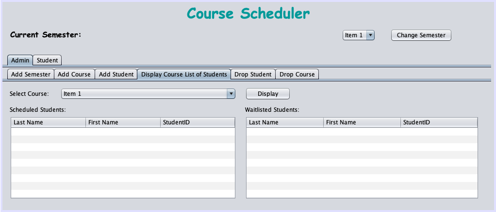
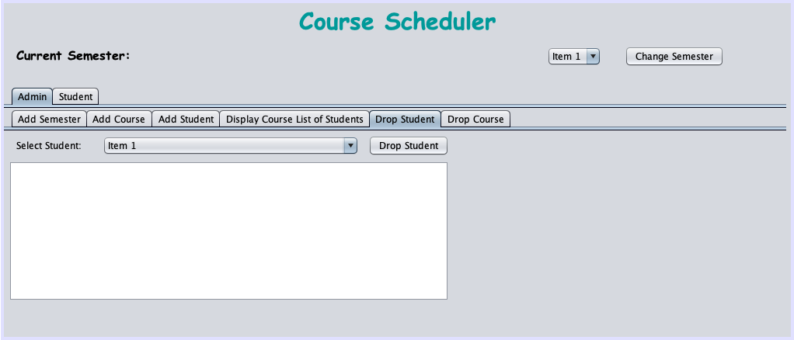
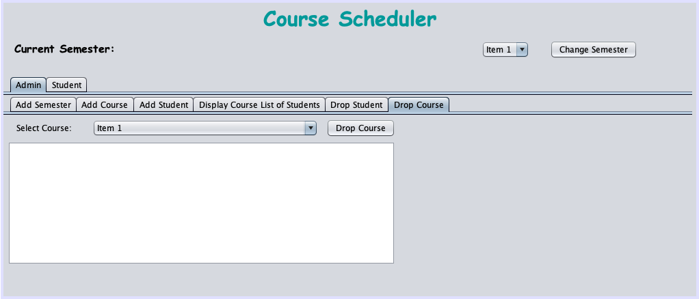
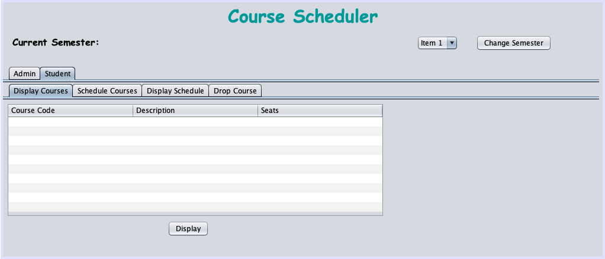
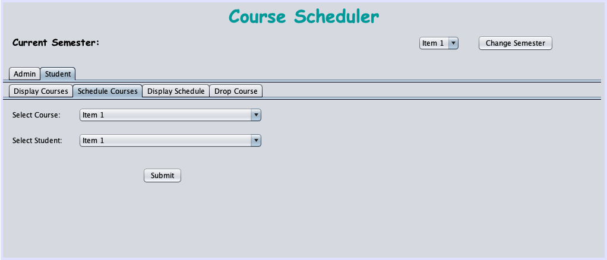
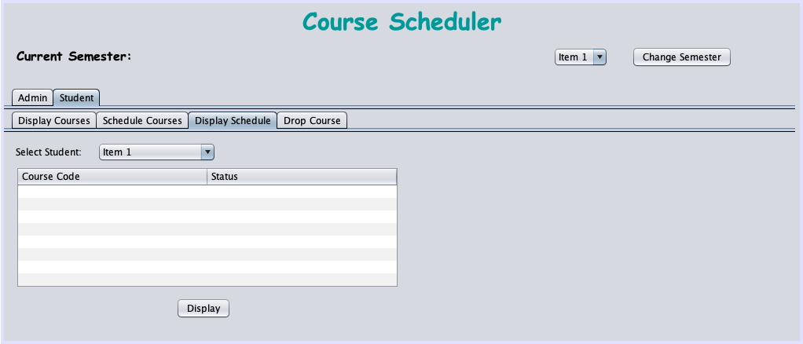
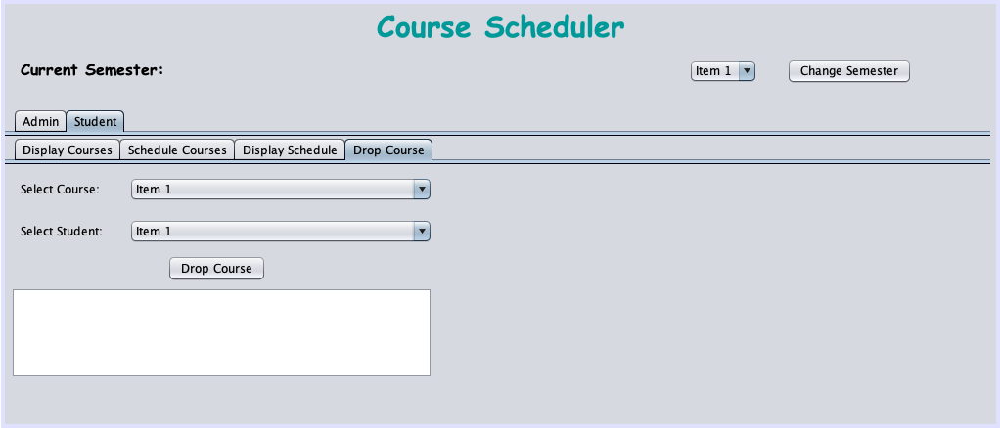

# 📚 Course Scheduler (Java + Derby DB + Swing UI)

This was a full-stack Java desktop application created for managing course scheduling across semesters. It uses **Apache Derby (Java DB)** for persistent storage and **Java Swing** for a GUI interface. I used NetBeans' Design tab to build the UI layout, and wrote backend logic to handle scheduling, dropping, and waitlisting.

> ⚠️ It’s been a while since I worked on this project, and I seem to have messed up my database setup. At the moment, I’m unable to connect to the Derby DB due to driver/config issues — but I plan to revisit and resolve this later.

---

## 🧩 Features

### 🎛 Admin Panel

-   Add Semester
-   Add Course (with seat limits)
-   Add Student
-   Display Course Roster
-   Drop Student (from all courses)
-   Drop Course (with waitlist rebalancing)

### 🎓 Student Panel

-   Display Available Courses
-   Schedule Course (auto-waitlist if full)
-   Display Schedule (with enrollment status)
-   Drop Course (auto-promote from waitlist)

### 🔁 Backend Logic

-   First-come-first-serve based on timestamps
-   Auto-promotes students from waitlist
-   Database interaction through query classes:
    -   `CourseQueries`, `StudentQueries`, `ScheduleQueries`, `SemesterQueries`

---

## ⚙️ Tech Stack

-   **Java SE**
-   **Apache Derby (Java DB)** — Network Server mode
-   **Swing** — UI built via NetBeans GUI builder
-   **Manual MVC Structure**

---

## 📸 Admin Panel Screenshots

---

## 📸 Student Panel Screenshots

---

## 📝 Notes

This project taught me how to:

-   Coordinate GUI and backend states cleanly
-   Implement robust scheduling logic
-   Work with Java DB in network mode
-   Design intuitive multi-role user flows

---

## 🧠 Let’s Connect!

**Tej Jaideep Patel**  
B.S. Computer Engineering  
📍 Penn State University  
✉️ tejpatelce@gmail.com  
📞 814-826-5544

---
